<div align="center">

# Nexora Role Features and Workflows

**An engineering guide to the Admin, Teacher, and Student experiences**

[](#admin-experience)
[](#teacher-experience)
[](#student-experience)
[](https://nextjs.org/)
[](#engineering-observations)

</div>

---

## Purpose

This document explains what each Nexora role can do, how those capabilities connect, and how data moves between users. It was derived from the frontend route tree, sidebar configuration, page components, route guard, shared API client, and direct API calls.

It complements the main [frontend README](./README.md), which focuses on installation and architecture. This guide focuses on product behavior and end-to-end workflows.

## Role Model at a Glance

| Role | Primary objective | Main workspace | Typical output |
| --- | --- | --- | --- |
| Admin | Govern the platform and control quality, access, and financial operations. | `/dashboard/admin/*` | Approved content, managed users, platform policies, announcements, certificates, and reports. |
| Teacher | Create and deliver structured learning experiences. | `/dashboard/teacher/*` | Courses, missions, clusters, sessions, tasks, resources, attendance, feedback, and announcements. |
| Student | Discover, purchase, and complete learning activities. | `/dashboard/student/*` | Enrollments, mission progress, submissions, study goals, annotations, achievements, and certificates. |

### Role interaction map

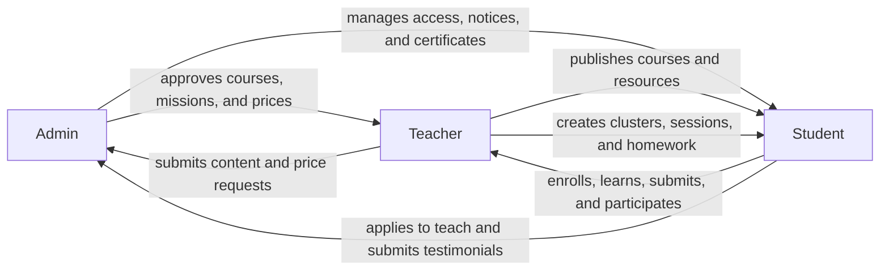
```mermaid
flowchart LR
    A["Admin"] -->|"approves courses, missions, and prices"| T["Teacher"]
    A -->|"manages access, notices, and certificates"| S["Student"]
    T -->|"publishes courses and resources"| S
    T -->|"creates clusters, sessions, and homework"| S
    S -->|"enrolls, learns, submits, and participates"| T
    S -->|"applies to teach and submits testimonials"| A
    T -->|"submits content and price requests"| A
```

## Shared Entry, Authentication, and Routing

All roles share the same authentication entry points and dashboard shell. The current route guard in `src/proxy.ts` checks the server-side session, email-verification state, and role before a protected page is rendered.

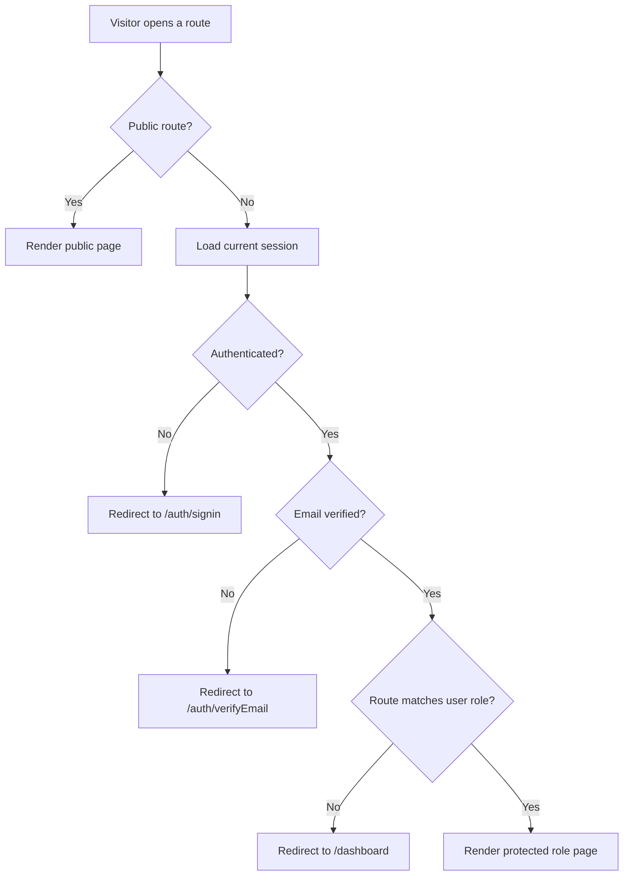
```mermaid
flowchart TD
    V["Visitor opens a route"] --> P{"Public route?"}
    P -->|"Yes"| PUBLIC["Render public page"]
    P -->|"No"| SESSION["Load current session"]
    SESSION --> AUTH{"Authenticated?"}
    AUTH -->|"No"| LOGIN["Redirect to /auth/signin"]
    AUTH -->|"Yes"| VERIFIED{"Email verified?"}
    VERIFIED -->|"No"| VERIFY["Redirect to /auth/verifyEmail"]
    VERIFIED -->|"Yes"| ROLE{"Route matches user role?"}
    ROLE -->|"No"| HOME["Redirect to /dashboard"]
    ROLE -->|"Yes"| PAGE["Render protected role page"]
```

### Shared capabilities

| Capability | How it works |
| --- | --- |
| Profile | Every role can view and update personal and role-specific profile information. |
| Account settings | Users manage notifications, privacy preferences, password, sessions, and account lifecycle. |
| Two-factor authentication | Users can check status, enable TOTP, verify a code, and disable 2FA. |
| Session management | Users can review sessions, revoke one session, or revoke all other sessions. |
| API keys | Users can create labeled keys and revoke individual or all keys. |
| Data export | Account data can be downloaded as a generated PDF. |
| Account controls | Users can deactivate or permanently delete their account through confirmation flows. |
| Theme and navigation | A shared responsive dashboard layout provides sidebar navigation, theme support, and role labeling. |

## Admin Experience

The Admin experience combines platform governance, content approval, access management, operational monitoring, financial oversight, and communication.

### Admin feature matrix

| Area | Route | Detailed capability |
| --- | --- | --- |
| Dashboard | `/dashboard` | Shows role-aware platform summary cards and activity data. |
| Platform analytics | `/dashboard/admin/analytics` | Displays user, teacher, student, cluster, session, resource, enrollment, storage, signup-trend, and revenue metrics. |
| User management | `/dashboard/admin/users` | Searches and filters users, updates account data, deactivates accounts, resets passwords, and initiates impersonation. |
| User detail | `/dashboard/admin/users/[id]` | Presents a focused user record for administrative review. |
| Privileged account creation | `/dashboard/admin/create` | Creates teacher or administrator accounts from one or multiple email addresses. |
| Course management | `/dashboard/admin/courses` | Lists all courses, filters records, opens details, toggles featured state, configures revenue percentage, approves, and deletes. |
| Course inspection | `/dashboard/admin/courses/[id]` | Reviews course metadata and missions before approving, rejecting, featuring, or deleting the course. |
| Course approvals | `/dashboard/admin/approvals/courses` | Processes the queue of teacher-submitted courses with approval or rejection notes. |
| Mission approvals | `/dashboard/admin/approvals/missions` | Reviews submitted missions independently and approves or rejects them. |
| Price approvals | `/dashboard/admin/approvals/price-requests` | Reviews requested prices, approves with an accepted price, or rejects with a reason. |
| Enrollment oversight | `/dashboard/admin/enrollments` | Searches and reviews platform-wide enrollment and payment state. |
| Revenue | `/dashboard/admin/revenue` | Reviews gross revenue, platform share, teacher earnings, and recent transactions. |
| Certificates | `/dashboard/admin/certificates` | Lists certificates and enrollments, then issues certificates for eligible enrollments. |
| Cluster oversight | `/dashboard/admin/cluster-oversight` | Monitors clusters and filters them by health or operational state. |
| Content moderation | `/dashboard/admin/content-moderation` | Reviews moderation queues, removes courses or resources, warns users, views warnings, and removes warnings. |
| Global announcements | `/dashboard/admin/global-announcements` | Creates broadcasts, targets individual users, lists announcements, and removes obsolete announcements. |
| Email templates | `/dashboard/admin/email-templates` | Creates, edits, and deletes reusable platform email templates. |
| Teacher applications | `/dashboard/admin/teacher-requests` | Reviews pending and historical teacher applications and approves or rejects candidates. |
| Testimonials | `/dashboard/admin/testimonials` | Reviews pending and approved testimonials, approves submissions, and removes testimonials. |
| Categories | `/dashboard/admin/category` | Provides a route for platform category management, though it is not currently linked in the admin sidebar. |

### Admin workflow: course governance

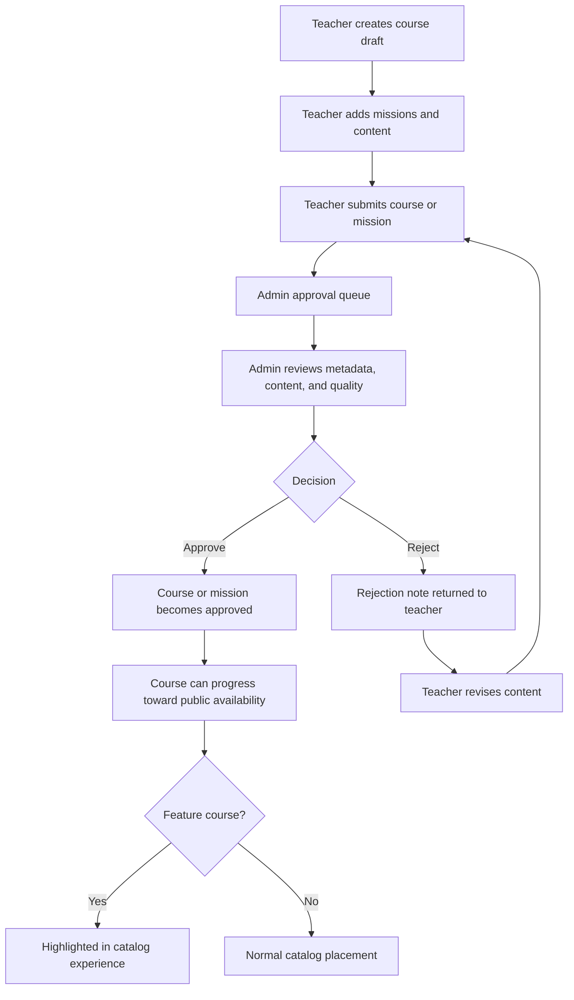
```mermaid
flowchart TD
    T1["Teacher creates course draft"] --> T2["Teacher adds missions and content"]
    T2 --> T3["Teacher submits course or mission"]
    T3 --> AQ["Admin approval queue"]
    AQ --> REVIEW["Admin reviews metadata, content, and quality"]
    REVIEW --> DECISION{"Decision"}
    DECISION -->|"Approve"| APPROVED["Course or mission becomes approved"]
    DECISION -->|"Reject"| REJECTED["Rejection note returned to teacher"]
    REJECTED --> EDIT["Teacher revises content"]
    EDIT --> T3
    APPROVED --> CATALOG["Course can progress toward public availability"]
    CATALOG --> FEATURE{"Feature course?"}
    FEATURE -->|"Yes"| PROMOTED["Highlighted in catalog experience"]
    FEATURE -->|"No"| STANDARD["Normal catalog placement"]
```

### Admin workflow: teacher application

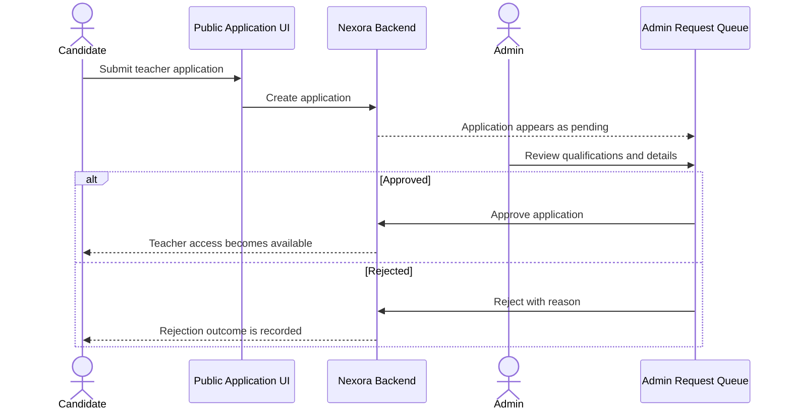
```mermaid
sequenceDiagram
    actor Candidate
    participant UI as Public Application UI
    participant API as Nexora Backend
    actor Admin
    participant Queue as Admin Request Queue

    Candidate->>UI: Submit teacher application
    UI->>API: Create application
    API-->>Queue: Application appears as pending
    Admin->>Queue: Review qualifications and details
    alt Approved
        Queue->>API: Approve application
        API-->>Candidate: Teacher access becomes available
    else Rejected
        Queue->>API: Reject with reason
        API-->>Candidate: Rejection outcome is recorded
    end
```

### Admin workflow: moderation and warning

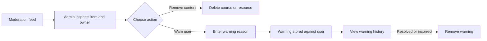
```mermaid
flowchart LR
    FEED["Moderation feed"] --> INSPECT["Admin inspects item and owner"]
    INSPECT --> ACTION{"Choose action"}
    ACTION -->|"Remove content"| REMOVE["Delete course or resource"]
    ACTION -->|"Warn user"| REASON["Enter warning reason"]
    REASON --> WARNING["Warning stored against user"]
    WARNING --> HISTORY["View warning history"]
    HISTORY -->|"Resolved or incorrect"| CLEAR["Remove warning"]
```

### Admin workflow: platform communication

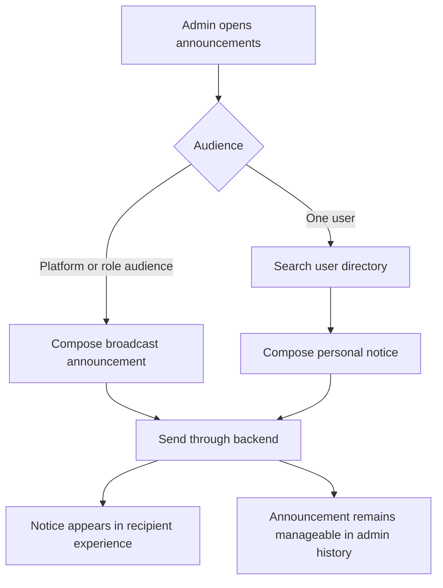
```mermaid
flowchart TD
    START["Admin opens announcements"] --> TARGET{"Audience"}
    TARGET -->|"Platform or role audience"| BROADCAST["Compose broadcast announcement"]
    TARGET -->|"One user"| SEARCH["Search user directory"]
    SEARCH --> PERSONAL["Compose personal notice"]
    BROADCAST --> SEND["Send through backend"]
    PERSONAL --> SEND
    SEND --> RECIPIENT["Notice appears in recipient experience"]
    SEND --> LIST["Announcement remains manageable in admin history"]
```

## Teacher Experience

The Teacher experience supports the full instructional lifecycle: course authoring, cohort organization, scheduled delivery, assessment, feedback, resource sharing, and performance analysis.

### Teacher feature matrix

| Area | Route | Detailed capability |
| --- | --- | --- |
| Dashboard | `/dashboard` | Displays teacher-focused metrics, summaries, and shortcuts. |
| Course library | `/dashboard/teacher/courses` | Lists owned courses by lifecycle status and supports filtering, navigation, and deletion. |
| Course creation | `/dashboard/teacher/courses/create` | Creates a course with thumbnail upload, title, description, category, level, duration, and initial price. |
| Course overview | `/dashboard/teacher/courses/[id]` | Shows course status, missions, enrollments, and actions to submit, close, or finish a course. |
| Course editing | `/dashboard/teacher/courses/[id]/edit` | Updates editable course metadata through the backend. |
| Mission authoring | `/dashboard/teacher/courses/[id]/missions` | Creates, edits, deletes, reorders, and submits missions; adds text, video, PDF, or other content items. |
| Enrollment review | `/dashboard/teacher/courses/[id]/enrollments` | Searches enrolled learners and reviews enrollment and payment statistics. |
| Price requests | `/dashboard/teacher/courses/priceRequests` | Selects a course, proposes a new price with a note, and reviews request history. |
| Course price history | `/dashboard/teacher/courses/[id]/priceRequests` | Reviews a selected course's requests and related enrollment information. |
| Earnings | `/dashboard/teacher/courses/earnings` | Displays earnings summary, course-level contribution, revenue percentage, and transactions. |
| Cluster creation | `/dashboard/teacher/cluster/create` | Creates a cohort with an AI-assisted description option and configured learning metadata. |
| Cluster management | `/dashboard/teacher/cluster/manageCluster` | Lists owned clusters, views details, updates them, adds members, removes members, and deletes clusters. |
| Session creation | `/dashboard/teacher/session/create` | Selects a cluster, schedules a session, configures tasks, assigns per-member work, and controls notifications. |
| Session management | `/dashboard/teacher/session/manageSession` | Filters sessions by ongoing, upcoming, completed, or cancelled state; updates agendas and session status. |
| Session detail | `/dashboard/teacher/session/manageSession/[sessionId]` | Reviews one session, its tasks, and attendance, and updates its status. |
| Attendance | `/dashboard/teacher/attendanceTracking` | Selects cluster and session, marks attendance, inspects learner history, and configures attendance warnings. |
| Homework | `/dashboard/teacher/homeworkManagement` | Selects sessions and members, creates or edits tasks, removes tasks, and reviews assignment state. |
| Submission review | `/dashboard/teacher/taskSubmission/[taskId]` | Opens a submitted task, records feedback and score, and marks the review outcome. |
| Task templates | `/dashboard/teacher/task-templates` | Creates, edits, and deletes reusable task definitions for faster session planning. |
| Resource upload | `/dashboard/teacher/resource/upload` | Uploads categorized files with authors, year, tags, visibility, and descriptive metadata. |
| Resource library | `/dashboard/teacher/resource/myResource` | Searches and filters owned resources and toggles bookmarks. |
| Categories | `/dashboard/teacher/category/create` | Manages resource categories, colors, and optional cluster association. |
| Announcements | `/dashboard/teacher/announcement/create` | Creates cluster announcements, reviews existing announcements, and deletes them. |
| Student progress | `/dashboard/teacher/studentProgress` | Aggregates member submission, attendance, and score data; highlights top performers and comparisons. |
| Analytics | `/dashboard/teacher/analytics` | Displays API-backed teaching and course performance indicators. |
| Session history | `/dashboard/teacher/session-history` | Filters API-backed historical sessions by cluster and date and supports export-oriented review. |
| Notices | `/dashboard/teacher/notice` | Reads personal or administrative notices and marks them as read. |

### Teacher workflow: build and publish a course

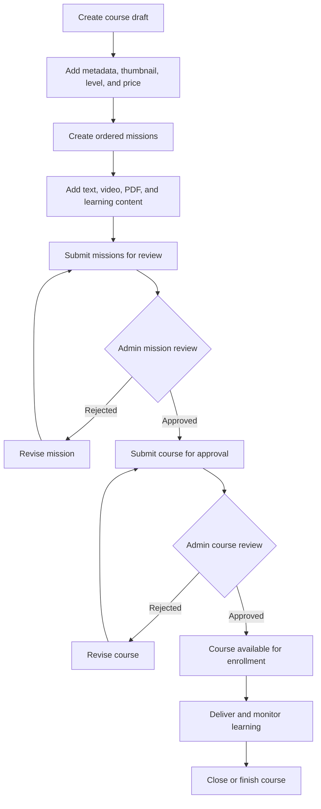
```mermaid
flowchart TD
    CREATE["Create course draft"] --> DETAILS["Add metadata, thumbnail, level, and price"]
    DETAILS --> MISSIONS["Create ordered missions"]
    MISSIONS --> CONTENT["Add text, video, PDF, and learning content"]
    CONTENT --> SUBMIT_M["Submit missions for review"]
    SUBMIT_M --> ADMIN_M{"Admin mission review"}
    ADMIN_M -->|"Rejected"| REVISE_M["Revise mission"]
    REVISE_M --> SUBMIT_M
    ADMIN_M -->|"Approved"| SUBMIT_C["Submit course for approval"]
    SUBMIT_C --> ADMIN_C{"Admin course review"}
    ADMIN_C -->|"Rejected"| REVISE_C["Revise course"]
    REVISE_C --> SUBMIT_C
    ADMIN_C -->|"Approved"| ACTIVE["Course available for enrollment"]
    ACTIVE --> TEACH["Deliver and monitor learning"]
    TEACH --> FINISH["Close or finish course"]
```

### Teacher workflow: cluster, session, and assessment

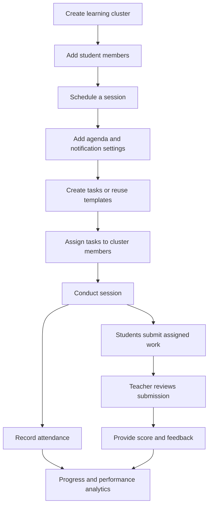
```mermaid
flowchart TD
    CLUSTER["Create learning cluster"] --> MEMBERS["Add student members"]
    MEMBERS --> SESSION["Schedule a session"]
    SESSION --> PLAN["Add agenda and notification settings"]
    PLAN --> TASKS["Create tasks or reuse templates"]
    TASKS --> ASSIGN["Assign tasks to cluster members"]
    ASSIGN --> RUN["Conduct session"]
    RUN --> ATTEND["Record attendance"]
    RUN --> STUDENT_WORK["Students submit assigned work"]
    STUDENT_WORK --> REVIEW["Teacher reviews submission"]
    REVIEW --> SCORE["Provide score and feedback"]
    ATTEND --> ANALYTICS["Progress and performance analytics"]
    SCORE --> ANALYTICS
```

### Teacher workflow: price change

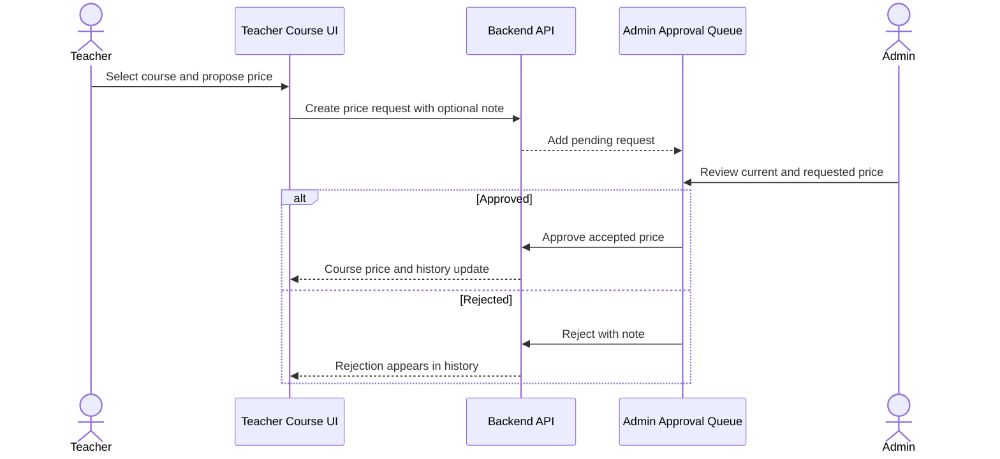
```mermaid
sequenceDiagram
    actor Teacher
    participant CourseUI as Teacher Course UI
    participant API as Backend API
    participant AdminUI as Admin Approval Queue
    actor Admin

    Teacher->>CourseUI: Select course and propose price
    CourseUI->>API: Create price request with optional note
    API-->>AdminUI: Add pending request
    Admin->>AdminUI: Review current and requested price
    alt Approved
        AdminUI->>API: Approve accepted price
        API-->>CourseUI: Course price and history update
    else Rejected
        AdminUI->>API: Reject with note
        API-->>CourseUI: Rejection appears in history
    end
```

### Teacher workflow: resource distribution

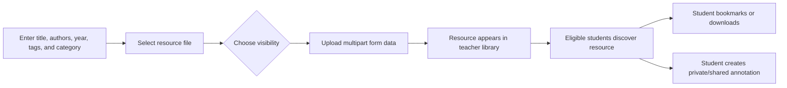
```mermaid
flowchart LR
    META["Enter title, authors, year, tags, and category"] --> FILE["Select resource file"]
    FILE --> VISIBILITY{"Choose visibility"}
    VISIBILITY --> UPLOAD["Upload multipart form data"]
    UPLOAD --> LIBRARY["Resource appears in teacher library"]
    LIBRARY --> DISCOVERY["Eligible students discover resource"]
    DISCOVERY --> BOOKMARK["Student bookmarks or downloads"]
    DISCOVERY --> ANNOTATE["Student creates private/shared annotation"]
```

## Student Experience

The Student experience covers discovery, enrollment, structured learning, cluster participation, assignments, self-management, collaboration, and proof of achievement.

### Student feature matrix

| Area | Route | Detailed capability |
| --- | --- | --- |
| Dashboard | `/dashboard` | Displays student-oriented metrics, upcoming work, and learning summaries. |
| Public catalog | `/courses` | Browses available courses before or after authentication. |
| Course details | `/courses/[id]` | Reviews public course information and begins enrollment. |
| Enrollment | `/courses/[id]/enroll` | Handles free enrollment or Stripe-backed paid enrollment. |
| My learning | `/dashboard/student/courses` | Synchronizes pending payments, then lists enrolled courses and progress. |
| Course player | `/dashboard/student/courses/[courseId]` | Opens missions, loads mission content, plays videos or presents files/text, and marks missions complete. |
| Payment history | `/dashboard/student/paymentHistory` | Reviews payment records, amounts, status, and associated courses. |
| My clusters | `/dashboard/student/cluster` | Lists clusters in which the learner is a member. |
| Cluster detail | `/dashboard/student/cluster/[clusterId]` | Presents cluster overview, sessions, members, and related learning activity. |
| Homework | `/dashboard/student/homework` | Lists assigned homework across sessions and routes the learner to submission. |
| Task submission | `/dashboard/student/taskSubmission` | Loads a task, accepts the learner's response, and sends the submission to the backend. |
| Progress | `/dashboard/student/progress` | Displays submission rate, average score, attendance, session timeline, badges, and pending homework. |
| Leaderboard | `/dashboard/student/leaderboard` | Switches between ranking periods and allows privacy-aware opt-in or opt-out. |
| Study planner | `/dashboard/student/study-planner` | Creates, edits, moves, completes, and deletes goals in a Kanban-style workflow while showing streak data. |
| Resource library | `/dashboard/student/resources/all` | Searches and filters available resources and toggles bookmarks. |
| Resource upload | `/dashboard/student/resources/upload` | Uploads a resource with metadata and visibility, if allowed by backend policy. |
| Resource annotations | `/dashboard/student/resource-annotation` | Selects a resource, loads personal and shared annotations, creates notes, shares or unshares them, and deletes them. |
| Certificates | `/dashboard/student/certificates` | Lists earned certificates and downloads certificate PDFs. |
| Notices | `/dashboard/student/notice` | Filters notices and marks individual notices as read. |

### Student workflow: discover, pay, and learn

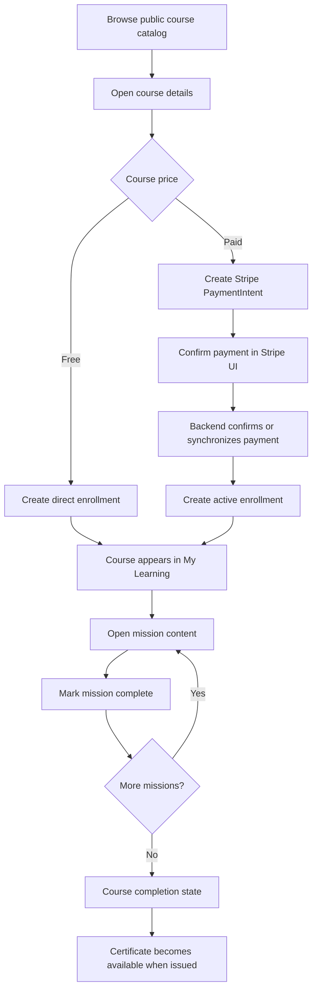
```mermaid
flowchart TD
    CATALOG["Browse public course catalog"] --> DETAIL["Open course details"]
    DETAIL --> ENROLL{"Course price"}
    ENROLL -->|"Free"| FREE["Create direct enrollment"]
    ENROLL -->|"Paid"| INTENT["Create Stripe PaymentIntent"]
    INTENT --> CONFIRM["Confirm payment in Stripe UI"]
    CONFIRM --> SYNC["Backend confirms or synchronizes payment"]
    SYNC --> PAID["Create active enrollment"]
    FREE --> LEARNING["Course appears in My Learning"]
    PAID --> LEARNING
    LEARNING --> MISSION["Open mission content"]
    MISSION --> COMPLETE["Mark mission complete"]
    COMPLETE --> MORE{"More missions?"}
    MORE -->|"Yes"| MISSION
    MORE -->|"No"| FINISHED["Course completion state"]
    FINISHED --> CERT["Certificate becomes available when issued"]
```

### Student workflow: homework and feedback

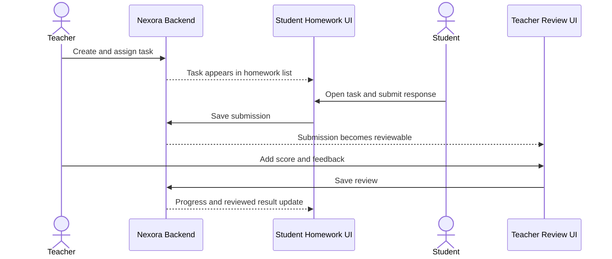
```mermaid
sequenceDiagram
    actor Teacher
    participant API as Nexora Backend
    participant StudentUI as Student Homework UI
    actor Student
    participant TeacherUI as Teacher Review UI

    Teacher->>API: Create and assign task
    API-->>StudentUI: Task appears in homework list
    Student->>StudentUI: Open task and submit response
    StudentUI->>API: Save submission
    API-->>TeacherUI: Submission becomes reviewable
    Teacher->>TeacherUI: Add score and feedback
    TeacherUI->>API: Save review
    API-->>StudentUI: Progress and reviewed result update
```

### Student workflow: personal study planner

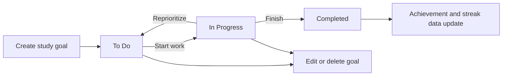
```mermaid
flowchart LR
    NEW["Create study goal"] --> TODO["To Do"]
    TODO -->|"Start work"| DOING["In Progress"]
    DOING -->|"Finish"| DONE["Completed"]
    DOING -->|"Reprioritize"| TODO
    DONE --> STREAK["Achievement and streak data update"]
    TODO --> EDIT["Edit or delete goal"]
    DOING --> EDIT
```

### Student workflow: annotation and sharing

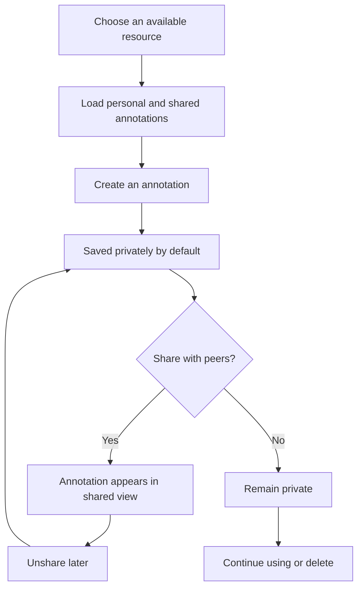
```mermaid
flowchart TD
    RESOURCE["Choose an available resource"] --> LOAD["Load personal and shared annotations"]
    LOAD --> NOTE["Create an annotation"]
    NOTE --> PRIVATE["Saved privately by default"]
    PRIVATE --> SHARE{"Share with peers?"}
    SHARE -->|"Yes"| SHARED["Annotation appears in shared view"]
    SHARE -->|"No"| KEEP["Remain private"]
    SHARED --> TOGGLE["Unshare later"]
    KEEP --> EDIT["Continue using or delete"]
    TOGGLE --> PRIVATE
```

## Cross-Role Product Workflows

### Complete learning lifecycle

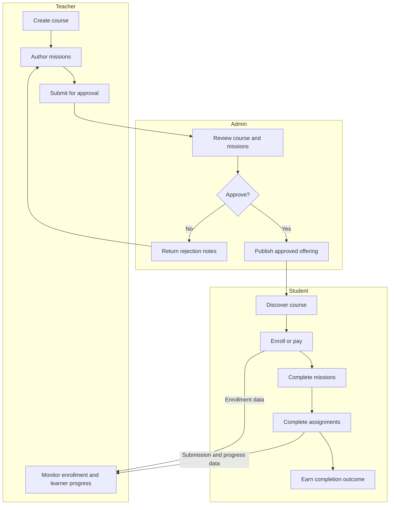
```mermaid
flowchart TB
    subgraph Teacher
        T1["Create course"] --> T2["Author missions"]
        T2 --> T3["Submit for approval"]
        T4["Monitor enrollment and learner progress"]
    end

    subgraph Admin
        A1["Review course and missions"] --> A2{"Approve?"}
        A2 -->|"No"| A3["Return rejection notes"]
        A2 -->|"Yes"| A4["Publish approved offering"]
    end

    subgraph Student
        S1["Discover course"] --> S2["Enroll or pay"]
        S2 --> S3["Complete missions"]
        S3 --> S4["Complete assignments"]
        S4 --> S5["Earn completion outcome"]
    end

    T3 --> A1
    A3 --> T2
    A4 --> S1
    S2 -->|"Enrollment data"| T4
    S4 -->|"Submission and progress data"| T4
```

### Platform data flow

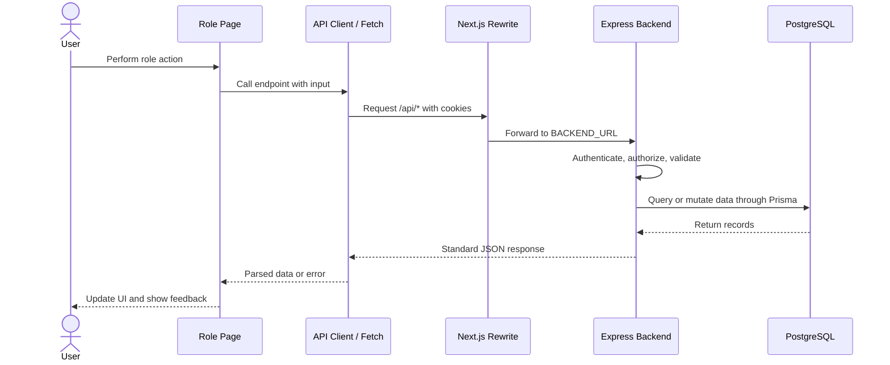
```mermaid
sequenceDiagram
    actor User
    participant Page as Role Page
    participant Client as API Client / Fetch
    participant Rewrite as Next.js Rewrite
    participant Backend as Express Backend
    participant DB as PostgreSQL

    User->>Page: Perform role action
    Page->>Client: Call endpoint with input
    Client->>Rewrite: Request /api/* with cookies
    Rewrite->>Backend: Forward to BACKEND_URL
    Backend->>Backend: Authenticate, authorize, validate
    Backend->>DB: Query or mutate data through Prisma
    DB-->>Backend: Return records
    Backend-->>Client: Standard JSON response
    Client-->>Page: Parsed data or error
    Page-->>User: Update UI and show feedback
```

## Route and API Ownership

The role pages use a mixture of centralized namespaces from `src/lib/api.ts` and direct `fetch` calls.

| API group | Main consumers | Scope |
| --- | --- | --- |
| `courseApi` | Teacher | Course lifecycle, missions, content, enrollments, price requests, and earnings. |
| `adminApi` | Admin | Courses, approvals, enrollments, revenue, and privileged account creation. |
| `adminPlatformApi` | Admin | Analytics, announcements, clusters, moderation, certificates, enrollment operations, and templates. |
| `adminUsersApi` | Admin | User search, updates, deactivation, reset, and impersonation. |
| `studentApi` | Student | Catalog support, enrollments, mission progress, and payment history. |
| `paymentApi` | Student | Payment intent, confirmation, status, and synchronization. |
| `leaderboardApi` | Student | Rankings and opt-in privacy state. |
| `studyPlannerApi` | Student | Goal CRUD, Kanban transitions, completion, and streak. |
| `annotationApi` | Student | Resources, private/shared annotations, updates, and deletion. |
| `teacherDashApi` | Teacher | Analytics, history, task templates, clusters, and member lookup. |
| `teacherNoticeApi` | Teacher | Notice listing and read status. |
| `settingsApi` | All roles | Account, privacy, password, 2FA, sessions, API keys, export, and account lifecycle. |

## Feature-by-Feature Sequence Diagrams

The diagrams below use a consistent professional sequence-diagram structure with six participants:

- **Admin** governs platform-wide access, quality, policy, and financial controls.
- **Teacher** creates and delivers learning activities.
- **Student** consumes learning, participates, and produces progress data.
- **Next.js Role UI** manages role-specific interaction and presentation state.
- **Express API** authenticates, authorizes, validates, and coordinates business rules.
- **PostgreSQL** persists authoritative application data.

Every feature from the role matrices maps to one canonical sequence. Messages run chronologically from top to bottom, shaded blocks separate role phases, and handoff notes explain how one role's persisted outcome enables the next role.

Role phases use transparent 10% accent colors—violet for Admin, teal for Teacher, and blue for Student—so labels and messages remain readable in both light and dark themes.

### Workflow index

| ID | Feature workflow | Admin features covered | Teacher features covered | Student features covered |
| --- | --- | --- | --- | --- |
| WF-01 | Role dashboard and analytics | Dashboard, platform analytics | Dashboard, analytics | Dashboard, progress summary |
| WF-02 | Profile and account security | Own profile/settings | Own profile/settings | Own profile/settings |
| WF-03 | User and privileged-access management | Users, user detail, create accounts | Receives teacher access | Receives account outcome |
| WF-04 | Teacher application | Reviews requests | Receives approved role | Submits application |
| WF-05 | Course lifecycle | Manages and approves courses | Creates, edits, submits, closes, finishes | Discovers approved course |
| WF-06 | Mission and content lifecycle | Approves/rejects missions | Authors, orders, and submits content | Consumes approved content |
| WF-07 | Pricing and revenue share | Approves prices and sets revenue percentage | Requests price and views earnings | Sees final price |
| WF-08 | Enrollment and payment | Oversees enrollments | Monitors enrollment | Enrolls and pays |
| WF-09 | Revenue and transaction reporting | Platform revenue | Teacher earnings | Payment history |
| WF-10 | Certificate lifecycle | Issues and oversees | Supplies completion evidence | Views and downloads |
| WF-11 | Cluster lifecycle | Oversees cluster health | Creates and manages members | Joins and views cluster |
| WF-12 | Session lifecycle | Observes platform activity | Creates and manages sessions | Participates in sessions |
| WF-13 | Attendance | Uses aggregate metrics | Records and reviews attendance | Receives attendance record |
| WF-14 | Homework and task assignment | Observes learning operations | Creates and assigns work | Receives homework |
| WF-15 | Submission, review, and feedback | Uses aggregate outcomes | Reviews and scores | Submits work and receives feedback |
| WF-16 | Task templates | No routine action | Creates and reuses templates | Receives instantiated task |
| WF-17 | Resource publishing | Moderates resources | Uploads and manages resources | Browses, bookmarks, or uploads |
| WF-18 | Category management | Governs platform categories | Creates resource categories | Uses categories for discovery |
| WF-19 | Resource annotations | Moderates source resource | Supplies learning resource | Creates and shares annotations |
| WF-20 | Announcements and notices | Broadcasts and targets notices | Sends cluster announcements | Receives and marks notices read |
| WF-21 | Content moderation and warnings | Removes content and warns users | May receive warning | May report or receive warning |
| WF-22 | Testimonials | Approves/removes testimonials | May submit testimonial | May submit testimonial |
| WF-23 | Email templates and delivery | Manages templates | Receives transactional email | Receives transactional email |
| WF-24 | Student progress | Oversees aggregate health | Analyzes learner performance | Generates and views progress |
| WF-25 | Leaderboard and privacy | Defines platform policy | Generates assessed activity | Opts in/out and views ranking |
| WF-26 | Study planner and streak | No routine action | Indirectly supplies learning context | Manages goals and streak |

### WF-01 — Role dashboard and analytics

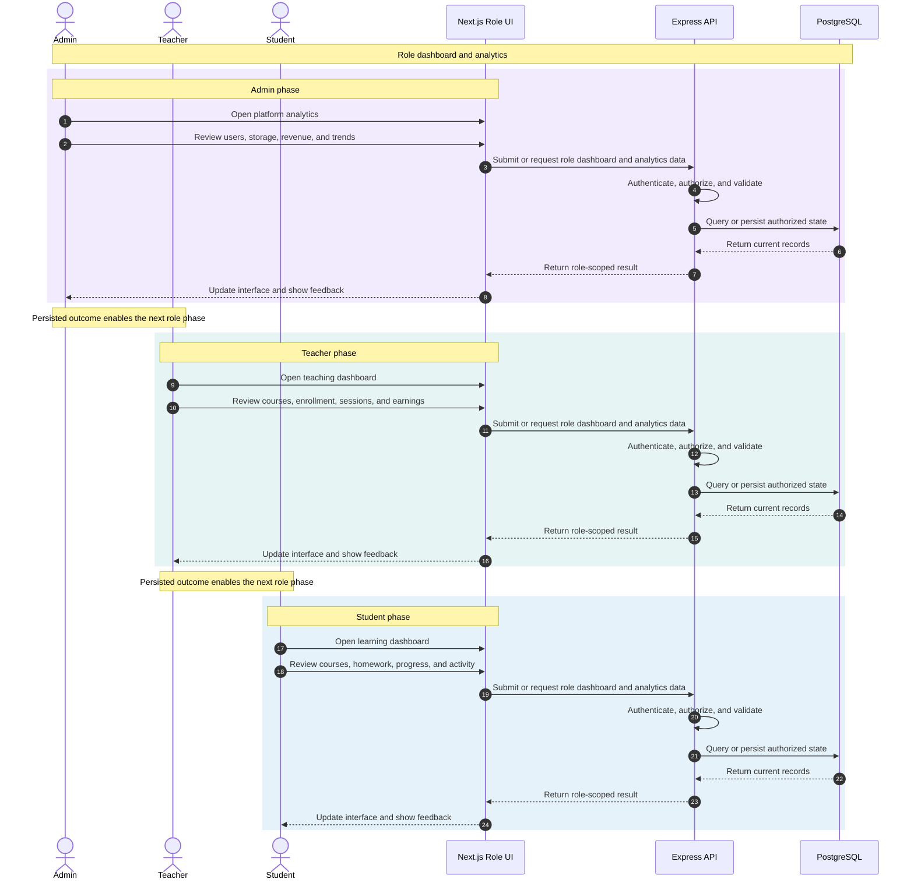
```mermaid
sequenceDiagram
    autonumber
    actor Admin
    actor Teacher
    actor Student
    participant UI as Next.js Role UI
    participant API as Express API
    participant DB as PostgreSQL
    Note over Admin,DB: Role dashboard and analytics
    rect rgba(124, 58, 237, 0.10)
    Note over Admin,UI: Admin phase
    Admin->>UI: Open platform analytics
    Admin->>UI: Review users, storage, revenue, and trends
    UI->>API: Submit or request role dashboard and analytics data
    API->>API: Authenticate, authorize, and validate
    API->>DB: Query or persist authorized state
    DB-->>API: Return current records
    API-->>UI: Return role-scoped result
    UI-->>Admin: Update interface and show feedback
    end
    Note over Admin,Teacher: Persisted outcome enables the next role phase
    rect rgba(13, 148, 136, 0.10)
    Note over Teacher,UI: Teacher phase
    Teacher->>UI: Open teaching dashboard
    Teacher->>UI: Review courses, enrollment, sessions, and earnings
    UI->>API: Submit or request role dashboard and analytics data
    API->>API: Authenticate, authorize, and validate
    API->>DB: Query or persist authorized state
    DB-->>API: Return current records
    API-->>UI: Return role-scoped result
    UI-->>Teacher: Update interface and show feedback
    end
    Note over Teacher,Student: Persisted outcome enables the next role phase
    rect rgba(2, 132, 199, 0.10)
    Note over Student,UI: Student phase
    Student->>UI: Open learning dashboard
    Student->>UI: Review courses, homework, progress, and activity
    UI->>API: Submit or request role dashboard and analytics data
    API->>API: Authenticate, authorize, and validate
    API->>DB: Query or persist authorized state
    DB-->>API: Return current records
    API-->>UI: Return role-scoped result
    UI-->>Student: Update interface and show feedback
    end
```

### WF-02 — Profile and account security

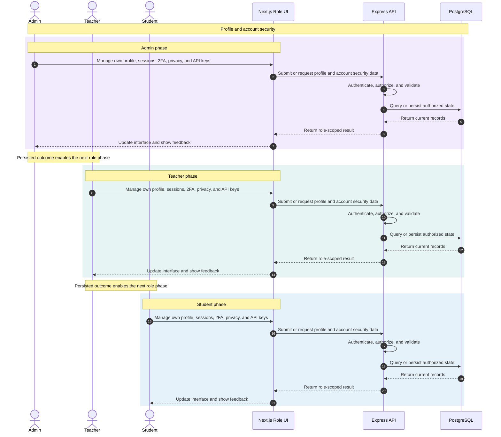
```mermaid
sequenceDiagram
    autonumber
    actor Admin
    actor Teacher
    actor Student
    participant UI as Next.js Role UI
    participant API as Express API
    participant DB as PostgreSQL
    Note over Admin,DB: Profile and account security
    rect rgba(124, 58, 237, 0.10)
    Note over Admin,UI: Admin phase
    Admin->>UI: Manage own profile, sessions, 2FA, privacy, and API keys
    UI->>API: Submit or request profile and account security data
    API->>API: Authenticate, authorize, and validate
    API->>DB: Query or persist authorized state
    DB-->>API: Return current records
    API-->>UI: Return role-scoped result
    UI-->>Admin: Update interface and show feedback
    end
    Note over Admin,Teacher: Persisted outcome enables the next role phase
    rect rgba(13, 148, 136, 0.10)
    Note over Teacher,UI: Teacher phase
    Teacher->>UI: Manage own profile, sessions, 2FA, privacy, and API keys
    UI->>API: Submit or request profile and account security data
    API->>API: Authenticate, authorize, and validate
    API->>DB: Query or persist authorized state
    DB-->>API: Return current records
    API-->>UI: Return role-scoped result
    UI-->>Teacher: Update interface and show feedback
    end
    Note over Teacher,Student: Persisted outcome enables the next role phase
    rect rgba(2, 132, 199, 0.10)
    Note over Student,UI: Student phase
    Student->>UI: Manage own profile, sessions, 2FA, privacy, and API keys
    UI->>API: Submit or request profile and account security data
    API->>API: Authenticate, authorize, and validate
    API->>DB: Query or persist authorized state
    DB-->>API: Return current records
    API-->>UI: Return role-scoped result
    UI-->>Student: Update interface and show feedback
    end
```

### WF-03 — User and privileged-access management

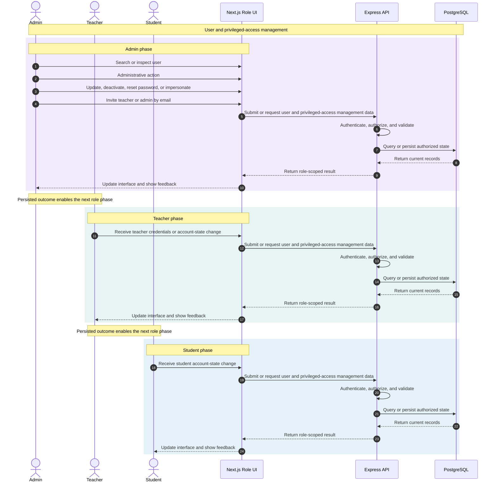
```mermaid
sequenceDiagram
    autonumber
    actor Admin
    actor Teacher
    actor Student
    participant UI as Next.js Role UI
    participant API as Express API
    participant DB as PostgreSQL
    Note over Admin,DB: User and privileged-access management
    rect rgba(124, 58, 237, 0.10)
    Note over Admin,UI: Admin phase
    Admin->>UI: Search or inspect user
    Admin->>UI: Administrative action
    Admin->>UI: Update, deactivate, reset password, or impersonate
    Admin->>UI: Invite teacher or admin by email
    UI->>API: Submit or request user and privileged-access management data
    API->>API: Authenticate, authorize, and validate
    API->>DB: Query or persist authorized state
    DB-->>API: Return current records
    API-->>UI: Return role-scoped result
    UI-->>Admin: Update interface and show feedback
    end
    Note over Admin,Teacher: Persisted outcome enables the next role phase
    rect rgba(13, 148, 136, 0.10)
    Note over Teacher,UI: Teacher phase
    Teacher->>UI: Receive teacher credentials or account-state change
    UI->>API: Submit or request user and privileged-access management data
    API->>API: Authenticate, authorize, and validate
    API->>DB: Query or persist authorized state
    DB-->>API: Return current records
    API-->>UI: Return role-scoped result
    UI-->>Teacher: Update interface and show feedback
    end
    Note over Teacher,Student: Persisted outcome enables the next role phase
    rect rgba(2, 132, 199, 0.10)
    Note over Student,UI: Student phase
    Student->>UI: Receive student account-state change
    UI->>API: Submit or request user and privileged-access management data
    API->>API: Authenticate, authorize, and validate
    API->>DB: Query or persist authorized state
    DB-->>API: Return current records
    API-->>UI: Return role-scoped result
    UI-->>Student: Update interface and show feedback
    end
```

### WF-04 — Teacher application

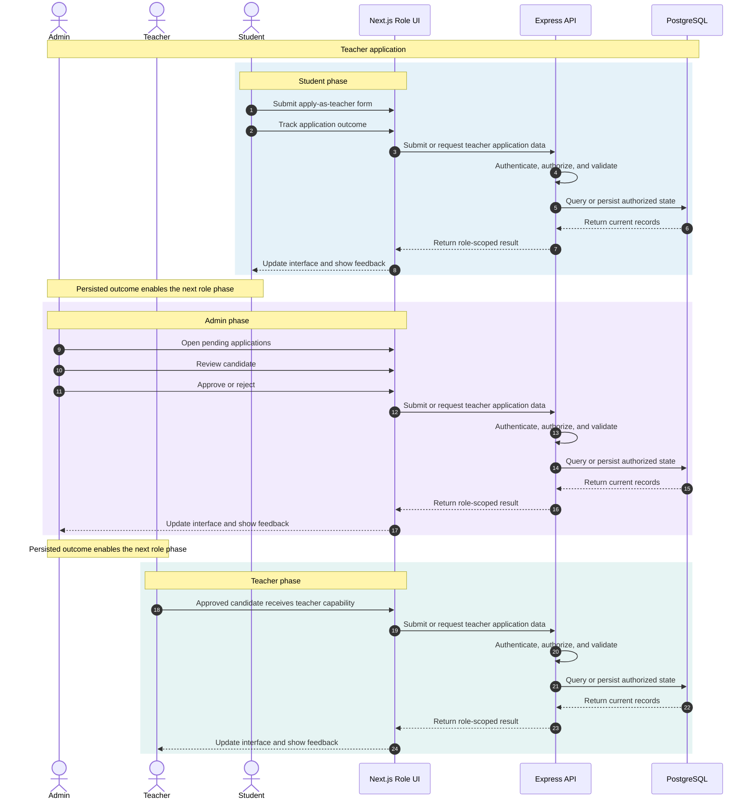
```mermaid
sequenceDiagram
    autonumber
    actor Admin
    actor Teacher
    actor Student
    participant UI as Next.js Role UI
    participant API as Express API
    participant DB as PostgreSQL
    Note over Admin,DB: Teacher application
    rect rgba(2, 132, 199, 0.10)
    Note over Student,UI: Student phase
    Student->>UI: Submit apply-as-teacher form
    Student->>UI: Track application outcome
    UI->>API: Submit or request teacher application data
    API->>API: Authenticate, authorize, and validate
    API->>DB: Query or persist authorized state
    DB-->>API: Return current records
    API-->>UI: Return role-scoped result
    UI-->>Student: Update interface and show feedback
    end
    Note over Student,Admin: Persisted outcome enables the next role phase
    rect rgba(124, 58, 237, 0.10)
    Note over Admin,UI: Admin phase
    Admin->>UI: Open pending applications
    Admin->>UI: Review candidate
    Admin->>UI: Approve or reject
    UI->>API: Submit or request teacher application data
    API->>API: Authenticate, authorize, and validate
    API->>DB: Query or persist authorized state
    DB-->>API: Return current records
    API-->>UI: Return role-scoped result
    UI-->>Admin: Update interface and show feedback
    end
    Note over Admin,Teacher: Persisted outcome enables the next role phase
    rect rgba(13, 148, 136, 0.10)
    Note over Teacher,UI: Teacher phase
    Teacher->>UI: Approved candidate receives teacher capability
    UI->>API: Submit or request teacher application data
    API->>API: Authenticate, authorize, and validate
    API->>DB: Query or persist authorized state
    DB-->>API: Return current records
    API-->>UI: Return role-scoped result
    UI-->>Teacher: Update interface and show feedback
    end
```

### WF-05 — Course lifecycle

```mermaid
sequenceDiagram
    autonumber
    actor Admin
    actor Teacher
    actor Student
    participant UI as Next.js Role UI
    participant API as Express API
    participant DB as PostgreSQL
    Note over Admin,DB: Course lifecycle
    rect rgba(13, 148, 136, 0.10)
    Note over Teacher,UI: Teacher phase
    Teacher->>UI: Create draft
    Teacher->>UI: Edit course details
    Teacher->>UI: Submit course
    Teacher->>UI: Revise rejected course
    UI->>API: Submit or request course lifecycle data
    API->>API: Authenticate, authorize, and validate
    API->>DB: Query or persist authorized state
    DB-->>API: Return current records
    API-->>UI: Return role-scoped result
    UI-->>Teacher: Update interface and show feedback
    end
    Note over Teacher,Admin: Persisted outcome enables the next role phase
    rect rgba(124, 58, 237, 0.10)
    Note over Admin,UI: Admin phase
    Admin->>UI: Review submitted course
    Admin->>UI: Quality decision
    Admin->>UI: Optionally feature course
    Admin->>UI: Return review note
    UI->>API: Submit or request course lifecycle data
    API->>API: Authenticate, authorize, and validate
    API->>DB: Query or persist authorized state
    DB-->>API: Return current records
    API-->>UI: Return role-scoped result
    UI-->>Admin: Update interface and show feedback
    end
    Note over Admin,Student: Persisted outcome enables the next role phase
    rect rgba(2, 132, 199, 0.10)
    Note over Student,UI: Student phase
    Student->>UI: Discover approved public course
    Student->>UI: Open course details
    UI->>API: Submit or request course lifecycle data
    API->>API: Authenticate, authorize, and validate
    API->>DB: Query or persist authorized state
    DB-->>API: Return current records
    API-->>UI: Return role-scoped result
    UI-->>Student: Update interface and show feedback
    end
```

### WF-06 — Mission and learning-content lifecycle

```mermaid
sequenceDiagram
    autonumber
    actor Admin
    actor Teacher
    actor Student
    participant UI as Next.js Role UI
    participant API as Express API
    participant DB as PostgreSQL
    Note over Admin,DB: Mission and learning-content lifecycle
    rect rgba(13, 148, 136, 0.10)
    Note over Teacher,UI: Teacher phase
    Teacher->>UI: Create mission
    Teacher->>UI: Add text, video, PDF, or other content
    Teacher->>UI: Reorder and submit
    Teacher->>UI: Revise rejected mission
    UI->>API: Submit or request mission and learning-content lifecycle data
    API->>API: Authenticate, authorize, and validate
    API->>DB: Query or persist authorized state
    DB-->>API: Return current records
    API-->>UI: Return role-scoped result
    UI-->>Teacher: Update interface and show feedback
    end
    Note over Teacher,Admin: Persisted outcome enables the next role phase
    rect rgba(124, 58, 237, 0.10)
    Note over Admin,UI: Admin phase
    Admin->>UI: Inspect submitted mission and content
    Admin->>UI: Approve or reject
    UI->>API: Submit or request mission and learning-content lifecycle data
    API->>API: Authenticate, authorize, and validate
    API->>DB: Query or persist authorized state
    DB-->>API: Return current records
    API-->>UI: Return role-scoped result
    UI-->>Admin: Update interface and show feedback
    end
    Note over Admin,Student: Persisted outcome enables the next role phase
    rect rgba(2, 132, 199, 0.10)
    Note over Student,UI: Student phase
    Student->>UI: Open approved mission
    Student->>UI: Consume ordered content
    Student->>UI: Mark mission complete
    UI->>API: Submit or request mission and learning-content lifecycle data
    API->>API: Authenticate, authorize, and validate
    API->>DB: Query or persist authorized state
    DB-->>API: Return current records
    API-->>UI: Return role-scoped result
    UI-->>Student: Update interface and show feedback
    end
```

### WF-07 — Pricing and revenue share

```mermaid
sequenceDiagram
    autonumber
    actor Admin
    actor Teacher
    actor Student
    participant UI as Next.js Role UI
    participant API as Express API
    participant DB as PostgreSQL
    Note over Admin,DB: Pricing and revenue share
    rect rgba(13, 148, 136, 0.10)
    Note over Teacher,UI: Teacher phase
    Teacher->>UI: Select course
    Teacher->>UI: Request price with note
    Teacher->>UI: Review request history
    UI->>API: Submit or request pricing and revenue share data
    API->>API: Authenticate, authorize, and validate
    API->>DB: Query or persist authorized state
    DB-->>API: Return current records
    API-->>UI: Return role-scoped result
    UI-->>Teacher: Update interface and show feedback
    end
    Note over Teacher,Admin: Persisted outcome enables the next role phase
    rect rgba(124, 58, 237, 0.10)
    Note over Admin,UI: Admin phase
    Admin->>UI: Review requested price
    Admin->>UI: Approve accepted price or reject
    Admin->>UI: Configure platform revenue percentage
    UI->>API: Submit or request pricing and revenue share data
    API->>API: Authenticate, authorize, and validate
    API->>DB: Query or persist authorized state
    DB-->>API: Return current records
    API-->>UI: Return role-scoped result
    UI-->>Admin: Update interface and show feedback
    end
    Note over Admin,Student: Persisted outcome enables the next role phase
    rect rgba(2, 132, 199, 0.10)
    Note over Student,UI: Student phase
    Student->>UI: See final approved course price
    UI->>API: Submit or request pricing and revenue share data
    API->>API: Authenticate, authorize, and validate
    API->>DB: Query or persist authorized state
    DB-->>API: Return current records
    API-->>UI: Return role-scoped result
    UI-->>Student: Update interface and show feedback
    end
```

### WF-08 — Enrollment and payment

```mermaid
sequenceDiagram
    autonumber
    actor Admin
    actor Teacher
    actor Student
    participant UI as Next.js Role UI
    participant API as Express API
    participant DB as PostgreSQL
    Note over Admin,DB: Enrollment and payment
    rect rgba(2, 132, 199, 0.10)
    Note over Student,UI: Student phase
    Student->>UI: Choose course
    Student->>UI: Free or paid
    Student->>UI: Confirm enrollment
    Student->>UI: Confirm Stripe payment
    UI->>API: Submit or request enrollment and payment data
    API->>API: Authenticate, authorize, and validate
    API->>DB: Query or persist authorized state
    DB-->>API: Return current records
    API-->>UI: Return role-scoped result
    UI-->>Student: Update interface and show feedback
    end
    Note over Student,Teacher: Persisted outcome enables the next role phase
    rect rgba(13, 148, 136, 0.10)
    Note over Teacher,UI: Teacher phase
    Teacher->>UI: Review course enrollment list and statistics
    UI->>API: Submit or request enrollment and payment data
    API->>API: Authenticate, authorize, and validate
    API->>DB: Query or persist authorized state
    DB-->>API: Return current records
    API-->>UI: Return role-scoped result
    UI-->>Teacher: Update interface and show feedback
    end
    Note over Teacher,Admin: Persisted outcome enables the next role phase
    rect rgba(124, 58, 237, 0.10)
    Note over Admin,UI: Admin phase
    Admin->>UI: Review all enrollments and payment state
    UI->>API: Submit or request enrollment and payment data
    API->>API: Authenticate, authorize, and validate
    API->>DB: Query or persist authorized state
    DB-->>API: Return current records
    API-->>UI: Return role-scoped result
    UI-->>Admin: Update interface and show feedback
    end
```

### WF-09 — Revenue and transaction reporting

```mermaid
sequenceDiagram
    autonumber
    actor Admin
    actor Teacher
    actor Student
    participant UI as Next.js Role UI
    participant API as Express API
    participant DB as PostgreSQL
    Note over Admin,DB: Revenue and transaction reporting
    rect rgba(2, 132, 199, 0.10)
    Note over Student,UI: Student phase
    Student->>UI: Review personal payment history and status
    UI->>API: Submit or request revenue and transaction reporting data
    API->>API: Authenticate, authorize, and validate
    API->>DB: Query or persist authorized state
    DB-->>API: Return current records
    API-->>UI: Return role-scoped result
    UI-->>Student: Update interface and show feedback
    end
    Note over Student,Teacher: Persisted outcome enables the next role phase
    rect rgba(13, 148, 136, 0.10)
    Note over Teacher,UI: Teacher phase
    Teacher->>UI: Review earnings by course and transaction
    UI->>API: Submit or request revenue and transaction reporting data
    API->>API: Authenticate, authorize, and validate
    API->>DB: Query or persist authorized state
    DB-->>API: Return current records
    API-->>UI: Return role-scoped result
    UI-->>Teacher: Update interface and show feedback
    end
    Note over Teacher,Admin: Persisted outcome enables the next role phase
    rect rgba(124, 58, 237, 0.10)
    Note over Admin,UI: Admin phase
    Admin->>UI: Review gross revenue, platform share, payouts, and transactions
    UI->>API: Submit or request revenue and transaction reporting data
    API->>API: Authenticate, authorize, and validate
    API->>DB: Query or persist authorized state
    DB-->>API: Return current records
    API-->>UI: Return role-scoped result
    UI-->>Admin: Update interface and show feedback
    end
```

### WF-10 — Certificate lifecycle

```mermaid
sequenceDiagram
    autonumber
    actor Admin
    actor Teacher
    actor Student
    participant UI as Next.js Role UI
    participant API as Express API
    participant DB as PostgreSQL
    Note over Admin,DB: Certificate lifecycle
    rect rgba(2, 132, 199, 0.10)
    Note over Student,UI: Student phase
    Student->>UI: Complete course requirements
    Student->>UI: View issued certificate
    Student->>UI: Download certificate PDF
    UI->>API: Submit or request certificate lifecycle data
    API->>API: Authenticate, authorize, and validate
    API->>DB: Query or persist authorized state
    DB-->>API: Return current records
    API-->>UI: Return role-scoped result
    UI-->>Student: Update interface and show feedback
    end
    Note over Student,Teacher: Persisted outcome enables the next role phase
    rect rgba(13, 148, 136, 0.10)
    Note over Teacher,UI: Teacher phase
    Teacher->>UI: Course completion and assessment provide eligibility evidence
    UI->>API: Submit or request certificate lifecycle data
    API->>API: Authenticate, authorize, and validate
    API->>DB: Query or persist authorized state
    DB-->>API: Return current records
    API-->>UI: Return role-scoped result
    UI-->>Teacher: Update interface and show feedback
    end
    Note over Teacher,Admin: Persisted outcome enables the next role phase
    rect rgba(124, 58, 237, 0.10)
    Note over Admin,UI: Admin phase
    Admin->>UI: Review eligible enrollment
    Admin->>UI: Generate certificate
    Admin->>UI: Oversee issued certificates
    UI->>API: Submit or request certificate lifecycle data
    API->>API: Authenticate, authorize, and validate
    API->>DB: Query or persist authorized state
    DB-->>API: Return current records
    API-->>UI: Return role-scoped result
    UI-->>Admin: Update interface and show feedback
    end
```

### WF-11 — Cluster lifecycle

```mermaid
sequenceDiagram
    autonumber
    actor Admin
    actor Teacher
    actor Student
    participant UI as Next.js Role UI
    participant API as Express API
    participant DB as PostgreSQL
    Note over Admin,DB: Cluster lifecycle
    rect rgba(13, 148, 136, 0.10)
    Note over Teacher,UI: Teacher phase
    Teacher->>UI: Create cluster
    Teacher->>UI: Add or remove members
    Teacher->>UI: Update or delete cluster
    UI->>API: Submit or request cluster lifecycle data
    API->>API: Authenticate, authorize, and validate
    API->>DB: Query or persist authorized state
    DB-->>API: Return current records
    API-->>UI: Return role-scoped result
    UI-->>Teacher: Update interface and show feedback
    end
    Note over Teacher,Student: Persisted outcome enables the next role phase
    rect rgba(2, 132, 199, 0.10)
    Note over Student,UI: Student phase
    Student->>UI: Join assigned cluster
    Student->>UI: View members, sessions, and activity
    UI->>API: Submit or request cluster lifecycle data
    API->>API: Authenticate, authorize, and validate
    API->>DB: Query or persist authorized state
    DB-->>API: Return current records
    API-->>UI: Return role-scoped result
    UI-->>Student: Update interface and show feedback
    end
    Note over Student,Admin: Persisted outcome enables the next role phase
    rect rgba(124, 58, 237, 0.10)
    Note over Admin,UI: Admin phase
    Admin->>UI: Monitor cluster health, membership, and activity
    UI->>API: Submit or request cluster lifecycle data
    API->>API: Authenticate, authorize, and validate
    API->>DB: Query or persist authorized state
    DB-->>API: Return current records
    API-->>UI: Return role-scoped result
    UI-->>Admin: Update interface and show feedback
    end
```

### WF-12 — Session lifecycle

```mermaid
sequenceDiagram
    autonumber
    actor Admin
    actor Teacher
    actor Student
    participant UI as Next.js Role UI
    participant API as Express API
    participant DB as PostgreSQL
    Note over Admin,DB: Session lifecycle
    rect rgba(13, 148, 136, 0.10)
    Note over Teacher,UI: Teacher phase
    Teacher->>UI: Select cluster
    Teacher->>UI: Schedule session and agenda
    Teacher->>UI: Manage upcoming or ongoing session
    Teacher->>UI: Complete or cancel
    UI->>API: Submit or request session lifecycle data
    API->>API: Authenticate, authorize, and validate
    API->>DB: Query or persist authorized state
    DB-->>API: Return current records
    API-->>UI: Return role-scoped result
    UI-->>Teacher: Update interface and show feedback
    end
    Note over Teacher,Student: Persisted outcome enables the next role phase
    rect rgba(2, 132, 199, 0.10)
    Note over Student,UI: Student phase
    Student->>UI: Receive session context
    Student->>UI: Participate in session
    Student->>UI: View resulting tasks and history
    UI->>API: Submit or request session lifecycle data
    API->>API: Authenticate, authorize, and validate
    API->>DB: Query or persist authorized state
    DB-->>API: Return current records
    API-->>UI: Return role-scoped result
    UI-->>Student: Update interface and show feedback
    end
    Note over Student,Admin: Persisted outcome enables the next role phase
    rect rgba(124, 58, 237, 0.10)
    Note over Admin,UI: Admin phase
    Admin->>UI: Observe aggregate session activity in analytics
    UI->>API: Submit or request session lifecycle data
    API->>API: Authenticate, authorize, and validate
    API->>DB: Query or persist authorized state
    DB-->>API: Return current records
    API-->>UI: Return role-scoped result
    UI-->>Admin: Update interface and show feedback
    end
```

### WF-13 — Attendance

```mermaid
sequenceDiagram
    autonumber
    actor Admin
    actor Teacher
    actor Student
    participant UI as Next.js Role UI
    participant API as Express API
    participant DB as PostgreSQL
    Note over Admin,DB: Attendance
    rect rgba(2, 132, 199, 0.10)
    Note over Student,UI: Student phase
    Student->>UI: Attend session
    Student->>UI: See attendance reflected in progress
    UI->>API: Submit or request attendance data
    API->>API: Authenticate, authorize, and validate
    API->>DB: Query or persist authorized state
    DB-->>API: Return current records
    API-->>UI: Return role-scoped result
    UI-->>Student: Update interface and show feedback
    end
    Note over Student,Teacher: Persisted outcome enables the next role phase
    rect rgba(13, 148, 136, 0.10)
    Note over Teacher,UI: Teacher phase
    Teacher->>UI: Select cluster and session
    Teacher->>UI: Mark each member present or absent
    Teacher->>UI: Review history and warning threshold
    UI->>API: Submit or request attendance data
    API->>API: Authenticate, authorize, and validate
    API->>DB: Query or persist authorized state
    DB-->>API: Return current records
    API-->>UI: Return role-scoped result
    UI-->>Teacher: Update interface and show feedback
    end
    Note over Teacher,Admin: Persisted outcome enables the next role phase
    rect rgba(124, 58, 237, 0.10)
    Note over Admin,UI: Admin phase
    Admin->>UI: Review aggregate attendance indicators
    UI->>API: Submit or request attendance data
    API->>API: Authenticate, authorize, and validate
    API->>DB: Query or persist authorized state
    DB-->>API: Return current records
    API-->>UI: Return role-scoped result
    UI-->>Admin: Update interface and show feedback
    end
```

### WF-14 — Homework and task assignment

```mermaid
sequenceDiagram
    autonumber
    actor Admin
    actor Teacher
    actor Student
    participant UI as Next.js Role UI
    participant API as Express API
    participant DB as PostgreSQL
    Note over Admin,DB: Homework and task assignment
    rect rgba(13, 148, 136, 0.10)
    Note over Teacher,UI: Teacher phase
    Teacher->>UI: Choose session and member
    Teacher->>UI: Create or reuse task
    Teacher->>UI: Assign, edit, or remove homework
    UI->>API: Submit or request homework and task assignment data
    API->>API: Authenticate, authorize, and validate
    API->>DB: Query or persist authorized state
    DB-->>API: Return current records
    API-->>UI: Return role-scoped result
    UI-->>Teacher: Update interface and show feedback
    end
    Note over Teacher,Student: Persisted outcome enables the next role phase
    rect rgba(2, 132, 199, 0.10)
    Note over Student,UI: Student phase
    Student->>UI: Receive homework
    Student->>UI: Review title, instructions, and due context
    UI->>API: Submit or request homework and task assignment data
    API->>API: Authenticate, authorize, and validate
    API->>DB: Query or persist authorized state
    DB-->>API: Return current records
    API-->>UI: Return role-scoped result
    UI-->>Student: Update interface and show feedback
    end
    Note over Student,Admin: Persisted outcome enables the next role phase
    rect rgba(124, 58, 237, 0.10)
    Note over Admin,UI: Admin phase
    Admin->>UI: Observe assignment activity through platform metrics
    UI->>API: Submit or request homework and task assignment data
    API->>API: Authenticate, authorize, and validate
    API->>DB: Query or persist authorized state
    DB-->>API: Return current records
    API-->>UI: Return role-scoped result
    UI-->>Admin: Update interface and show feedback
    end
```

### WF-15 — Submission, review, and feedback

```mermaid
sequenceDiagram
    autonumber
    actor Admin
    actor Teacher
    actor Student
    participant UI as Next.js Role UI
    participant API as Express API
    participant DB as PostgreSQL
    Note over Admin,DB: Submission, review, and feedback
    rect rgba(2, 132, 199, 0.10)
    Note over Student,UI: Student phase
    Student->>UI: Open assigned task
    Student->>UI: Submit response
    Student->>UI: View review, score, and updated progress
    UI->>API: Submit or request submission, review, and feedback data
    API->>API: Authenticate, authorize, and validate
    API->>DB: Query or persist authorized state
    DB-->>API: Return current records
    API-->>UI: Return role-scoped result
    UI-->>Student: Update interface and show feedback
    end
    Note over Student,Teacher: Persisted outcome enables the next role phase
    rect rgba(13, 148, 136, 0.10)
    Note over Teacher,UI: Teacher phase
    Teacher->>UI: Open submitted task
    Teacher->>UI: Inspect response
    Teacher->>UI: Record score and feedback
    UI->>API: Submit or request submission, review, and feedback data
    API->>API: Authenticate, authorize, and validate
    API->>DB: Query or persist authorized state
    DB-->>API: Return current records
    API-->>UI: Return role-scoped result
    UI-->>Teacher: Update interface and show feedback
    end
    Note over Teacher,Admin: Persisted outcome enables the next role phase
    rect rgba(124, 58, 237, 0.10)
    Note over Admin,UI: Admin phase
    Admin->>UI: Consume aggregate completion and quality metrics
    UI->>API: Submit or request submission, review, and feedback data
    API->>API: Authenticate, authorize, and validate
    API->>DB: Query or persist authorized state
    DB-->>API: Return current records
    API-->>UI: Return role-scoped result
    UI-->>Admin: Update interface and show feedback
    end
```

### WF-16 — Task templates

```mermaid
sequenceDiagram
    autonumber
    actor Admin
    actor Teacher
    actor Student
    participant UI as Next.js Role UI
    participant API as Express API
    participant DB as PostgreSQL
    Note over Admin,DB: Task templates
    rect rgba(13, 148, 136, 0.10)
    Note over Teacher,UI: Teacher phase
    Teacher->>UI: Create reusable template
    Teacher->>UI: Edit or organize library
    Teacher->>UI: Select template during session planning
    UI->>API: Submit or request task templates data
    API->>API: Authenticate, authorize, and validate
    API->>DB: Query or persist authorized state
    DB-->>API: Return current records
    API-->>UI: Return role-scoped result
    UI-->>Teacher: Update interface and show feedback
    end
    Note over Teacher,Student: Persisted outcome enables the next role phase
    rect rgba(2, 132, 199, 0.10)
    Note over Student,UI: Student phase
    Student->>UI: Receive instantiated assignment, not the private template
    UI->>API: Submit or request task templates data
    API->>API: Authenticate, authorize, and validate
    API->>DB: Query or persist authorized state
    DB-->>API: Return current records
    API-->>UI: Return role-scoped result
    UI-->>Student: Update interface and show feedback
    end
    Note over Student,Admin: Persisted outcome enables the next role phase
    rect rgba(124, 58, 237, 0.10)
    Note over Admin,UI: Admin phase
    Admin->>UI: No routine action; platform policy still applies
    UI->>API: Submit or request task templates data
    API->>API: Authenticate, authorize, and validate
    API->>DB: Query or persist authorized state
    DB-->>API: Return current records
    API-->>UI: Return role-scoped result
    UI-->>Admin: Update interface and show feedback
    end
```

### WF-17 — Resource publishing and discovery

```mermaid
sequenceDiagram
    autonumber
    actor Admin
    actor Teacher
    actor Student
    participant UI as Next.js Role UI
    participant API as Express API
    participant DB as PostgreSQL
    Note over Admin,DB: Resource publishing and discovery
    rect rgba(13, 148, 136, 0.10)
    Note over Teacher,UI: Teacher phase
    Teacher->>UI: Upload file and metadata
    Teacher->>UI: Set category and visibility
    Teacher->>UI: Manage resource library
    UI->>API: Submit or request resource publishing and discovery data
    API->>API: Authenticate, authorize, and validate
    API->>DB: Query or persist authorized state
    DB-->>API: Return current records
    API-->>UI: Return role-scoped result
    UI-->>Teacher: Update interface and show feedback
    end
    Note over Teacher,Student: Persisted outcome enables the next role phase
    rect rgba(2, 132, 199, 0.10)
    Note over Student,UI: Student phase
    Student->>UI: Browse and filter eligible resources
    Student->>UI: Open, download, or bookmark
    Student->>UI: Optionally upload resource if policy allows
    UI->>API: Submit or request resource publishing and discovery data
    API->>API: Authenticate, authorize, and validate
    API->>DB: Query or persist authorized state
    DB-->>API: Return current records
    API-->>UI: Return role-scoped result
    UI-->>Student: Update interface and show feedback
    end
    Note over Student,Admin: Persisted outcome enables the next role phase
    rect rgba(124, 58, 237, 0.10)
    Note over Admin,UI: Admin phase
    Admin->>UI: Review or remove unsafe resource
    UI->>API: Submit or request resource publishing and discovery data
    API->>API: Authenticate, authorize, and validate
    API->>DB: Query or persist authorized state
    DB-->>API: Return current records
    API-->>UI: Return role-scoped result
    UI-->>Admin: Update interface and show feedback
    end
```

### WF-18 — Category management

```mermaid
sequenceDiagram
    autonumber
    actor Admin
    actor Teacher
    actor Student
    participant UI as Next.js Role UI
    participant API as Express API
    participant DB as PostgreSQL
    Note over Admin,DB: Category management
    rect rgba(124, 58, 237, 0.10)
    Note over Admin,UI: Admin phase
    Admin->>UI: Govern platform category taxonomy
    UI->>API: Submit or request category management data
    API->>API: Authenticate, authorize, and validate
    API->>DB: Query or persist authorized state
    DB-->>API: Return current records
    API-->>UI: Return role-scoped result
    UI-->>Admin: Update interface and show feedback
    end
    Note over Admin,Teacher: Persisted outcome enables the next role phase
    rect rgba(13, 148, 136, 0.10)
    Note over Teacher,UI: Teacher phase
    Teacher->>UI: Create or edit resource category
    Teacher->>UI: Assign color and optional cluster
    Teacher->>UI: Apply category to resource
    UI->>API: Submit or request category management data
    API->>API: Authenticate, authorize, and validate
    API->>DB: Query or persist authorized state
    DB-->>API: Return current records
    API-->>UI: Return role-scoped result
    UI-->>Teacher: Update interface and show feedback
    end
    Note over Teacher,Student: Persisted outcome enables the next role phase
    rect rgba(2, 132, 199, 0.10)
    Note over Student,UI: Student phase
    Student->>UI: Filter resource discovery by category
    UI->>API: Submit or request category management data
    API->>API: Authenticate, authorize, and validate
    API->>DB: Query or persist authorized state
    DB-->>API: Return current records
    API-->>UI: Return role-scoped result
    UI-->>Student: Update interface and show feedback
    end
```

### WF-19 — Resource annotations and sharing

```mermaid
sequenceDiagram
    autonumber
    actor Admin
    actor Teacher
    actor Student
    participant UI as Next.js Role UI
    participant API as Express API
    participant DB as PostgreSQL
    Note over Admin,DB: Resource annotations and sharing
    rect rgba(13, 148, 136, 0.10)
    Note over Teacher,UI: Teacher phase
    Teacher->>UI: Publish learning resource
    UI->>API: Submit or request resource annotations and sharing data
    API->>API: Authenticate, authorize, and validate
    API->>DB: Query or persist authorized state
    DB-->>API: Return current records
    API-->>UI: Return role-scoped result
    UI-->>Teacher: Update interface and show feedback
    end
    Note over Teacher,Student: Persisted outcome enables the next role phase
    rect rgba(2, 132, 199, 0.10)
    Note over Student,UI: Student phase
    Student->>UI: Select resource
    Student->>UI: Create private annotation
    Student->>UI: Share with peers
    Student->>UI: Publish shared annotation
    UI->>API: Submit or request resource annotations and sharing data
    API->>API: Authenticate, authorize, and validate
    API->>DB: Query or persist authorized state
    DB-->>API: Return current records
    API-->>UI: Return role-scoped result
    UI-->>Student: Update interface and show feedback
    end
    Note over Student,Admin: Persisted outcome enables the next role phase
    rect rgba(124, 58, 237, 0.10)
    Note over Admin,UI: Admin phase
    Admin->>UI: Moderate the underlying resource when necessary
    UI->>API: Submit or request resource annotations and sharing data
    API->>API: Authenticate, authorize, and validate
    API->>DB: Query or persist authorized state
    DB-->>API: Return current records
    API-->>UI: Return role-scoped result
    UI-->>Admin: Update interface and show feedback
    end
```

### WF-20 — Announcements and notices

```mermaid
sequenceDiagram
    autonumber
    actor Admin
    actor Teacher
    actor Student
    participant UI as Next.js Role UI
    participant API as Express API
    participant DB as PostgreSQL
    Note over Admin,DB: Announcements and notices
    rect rgba(124, 58, 237, 0.10)
    Note over Admin,UI: Admin phase
    Admin->>UI: Compose global, role-based, or personal notice
    Admin->>UI: Manage announcement history
    UI->>API: Submit or request announcements and notices data
    API->>API: Authenticate, authorize, and validate
    API->>DB: Query or persist authorized state
    DB-->>API: Return current records
    API-->>UI: Return role-scoped result
    UI-->>Admin: Update interface and show feedback
    end
    Note over Admin,Teacher: Persisted outcome enables the next role phase
    rect rgba(13, 148, 136, 0.10)
    Note over Teacher,UI: Teacher phase
    Teacher->>UI: Compose cluster announcement
    Teacher->>UI: Receive admin notice and mark read
    UI->>API: Submit or request announcements and notices data
    API->>API: Authenticate, authorize, and validate
    API->>DB: Query or persist authorized state
    DB-->>API: Return current records
    API-->>UI: Return role-scoped result
    UI-->>Teacher: Update interface and show feedback
    end
    Note over Teacher,Student: Persisted outcome enables the next role phase
    rect rgba(2, 132, 199, 0.10)
    Note over Student,UI: Student phase
    Student->>UI: Receive relevant platform or cluster notice
    Student->>UI: Filter and mark read
    UI->>API: Submit or request announcements and notices data
    API->>API: Authenticate, authorize, and validate
    API->>DB: Query or persist authorized state
    DB-->>API: Return current records
    API-->>UI: Return role-scoped result
    UI-->>Student: Update interface and show feedback
    end
```

### WF-21 — Content moderation and warnings

```mermaid
sequenceDiagram
    autonumber
    actor Admin
    actor Teacher
    actor Student
    participant UI as Next.js Role UI
    participant API as Express API
    participant DB as PostgreSQL
    Note over Admin,DB: Content moderation and warnings
    rect rgba(13, 148, 136, 0.10)
    Note over Teacher,UI: Teacher phase
    Teacher->>UI: Own course or resource under review
    Teacher->>UI: Receive removal or warning outcome
    UI->>API: Submit or request content moderation and warnings data
    API->>API: Authenticate, authorize, and validate
    API->>DB: Query or persist authorized state
    DB-->>API: Return current records
    API-->>UI: Return role-scoped result
    UI-->>Teacher: Update interface and show feedback
    end
    Note over Teacher,Student: Persisted outcome enables the next role phase
    rect rgba(2, 132, 199, 0.10)
    Note over Student,UI: Student phase
    Student->>UI: Own or encounter content under policy
    Student->>UI: Receive safe catalog or warning outcome
    UI->>API: Submit or request content moderation and warnings data
    API->>API: Authenticate, authorize, and validate
    API->>DB: Query or persist authorized state
    DB-->>API: Return current records
    API-->>UI: Return role-scoped result
    UI-->>Student: Update interface and show feedback
    end
    Note over Student,Admin: Persisted outcome enables the next role phase
    rect rgba(124, 58, 237, 0.10)
    Note over Admin,UI: Admin phase
    Admin->>UI: Inspect moderation feed
    Admin->>UI: Remove content or warn owner
    Admin->>UI: Review or clear warning history
    UI->>API: Submit or request content moderation and warnings data
    API->>API: Authenticate, authorize, and validate
    API->>DB: Query or persist authorized state
    DB-->>API: Return current records
    API-->>UI: Return role-scoped result
    UI-->>Admin: Update interface and show feedback
    end
```

### WF-22 — Testimonials

```mermaid
sequenceDiagram
    autonumber
    actor Admin
    actor Teacher
    actor Student
    participant UI as Next.js Role UI
    participant API as Express API
    participant DB as PostgreSQL
    Note over Admin,DB: Testimonials
    rect rgba(13, 148, 136, 0.10)
    Note over Teacher,UI: Teacher phase
    Teacher->>UI: Submit experience testimonial
    UI->>API: Submit or request testimonials data
    API->>API: Authenticate, authorize, and validate
    API->>DB: Query or persist authorized state
    DB-->>API: Return current records
    API-->>UI: Return role-scoped result
    UI-->>Teacher: Update interface and show feedback
    end
    Note over Teacher,Student: Persisted outcome enables the next role phase
    rect rgba(2, 132, 199, 0.10)
    Note over Student,UI: Student phase
    Student->>UI: Submit learning testimonial
    Student->>UI: View approved testimonials on public site
    UI->>API: Submit or request testimonials data
    API->>API: Authenticate, authorize, and validate
    API->>DB: Query or persist authorized state
    DB-->>API: Return current records
    API-->>UI: Return role-scoped result
    UI-->>Student: Update interface and show feedback
    end
    Note over Student,Admin: Persisted outcome enables the next role phase
    rect rgba(124, 58, 237, 0.10)
    Note over Admin,UI: Admin phase
    Admin->>UI: Review pending testimonial
    Admin->>UI: Approve or remove
    UI->>API: Submit or request testimonials data
    API->>API: Authenticate, authorize, and validate
    API->>DB: Query or persist authorized state
    DB-->>API: Return current records
    API-->>UI: Return role-scoped result
    UI-->>Admin: Update interface and show feedback
    end
```

### WF-23 — Email templates and delivery

```mermaid
sequenceDiagram
    autonumber
    actor Admin
    actor Teacher
    actor Student
    participant UI as Next.js Role UI
    participant API as Express API
    participant DB as PostgreSQL
    Note over Admin,DB: Email templates and delivery
    rect rgba(124, 58, 237, 0.10)
    Note over Admin,UI: Admin phase
    Admin->>UI: Create or edit reusable email template
    Admin->>UI: Delete obsolete template
    UI->>API: Submit or request email templates and delivery data
    API->>API: Authenticate, authorize, and validate
    API->>DB: Query or persist authorized state
    DB-->>API: Return current records
    API-->>UI: Return role-scoped result
    UI-->>Admin: Update interface and show feedback
    end
    Note over Admin,Teacher: Persisted outcome enables the next role phase
    rect rgba(13, 148, 136, 0.10)
    Note over Teacher,UI: Teacher phase
    Teacher->>UI: Trigger or receive role-relevant transactional email
    UI->>API: Submit or request email templates and delivery data
    API->>API: Authenticate, authorize, and validate
    API->>DB: Query or persist authorized state
    DB-->>API: Return current records
    API-->>UI: Return role-scoped result
    UI-->>Teacher: Update interface and show feedback
    end
    Note over Teacher,Student: Persisted outcome enables the next role phase
    rect rgba(2, 132, 199, 0.10)
    Note over Student,UI: Student phase
    Student->>UI: Trigger or receive verification, recovery, and learning email
    UI->>API: Submit or request email templates and delivery data
    API->>API: Authenticate, authorize, and validate
    API->>DB: Query or persist authorized state
    DB-->>API: Return current records
    API-->>UI: Return role-scoped result
    UI-->>Student: Update interface and show feedback
    end
```

### WF-24 — Student progress and performance insight

```mermaid
sequenceDiagram
    autonumber
    actor Admin
    actor Teacher
    actor Student
    participant UI as Next.js Role UI
    participant API as Express API
    participant DB as PostgreSQL
    Note over Admin,DB: Student progress and performance insight
    rect rgba(2, 132, 199, 0.10)
    Note over Student,UI: Student phase
    Student->>UI: Attend, submit, and complete activities
    Student->>UI: View rates, timeline, badges, and pending work
    UI->>API: Submit or request student progress and performance insight data
    API->>API: Authenticate, authorize, and validate
    API->>DB: Query or persist authorized state
    DB-->>API: Return current records
    API-->>UI: Return role-scoped result
    UI-->>Student: Update interface and show feedback
    end
    Note over Student,Teacher: Persisted outcome enables the next role phase
    rect rgba(13, 148, 136, 0.10)
    Note over Teacher,UI: Teacher phase
    Teacher->>UI: Select cluster members
    Teacher->>UI: Compare submissions, attendance, and scores
    Teacher->>UI: Identify support needs and top performers
    UI->>API: Submit or request student progress and performance insight data
    API->>API: Authenticate, authorize, and validate
    API->>DB: Query or persist authorized state
    DB-->>API: Return current records
    API-->>UI: Return role-scoped result
    UI-->>Teacher: Update interface and show feedback
    end
    Note over Teacher,Admin: Persisted outcome enables the next role phase
    rect rgba(124, 58, 237, 0.10)
    Note over Admin,UI: Admin phase
    Admin->>UI: Review aggregate learning and platform health
    UI->>API: Submit or request student progress and performance insight data
    API->>API: Authenticate, authorize, and validate
    API->>DB: Query or persist authorized state
    DB-->>API: Return current records
    API-->>UI: Return role-scoped result
    UI-->>Admin: Update interface and show feedback
    end
```

### WF-25 — Leaderboard and privacy

```mermaid
sequenceDiagram
    autonumber
    actor Admin
    actor Teacher
    actor Student
    participant UI as Next.js Role UI
    participant API as Express API
    participant DB as PostgreSQL
    Note over Admin,DB: Leaderboard and privacy
    rect rgba(13, 148, 136, 0.10)
    Note over Teacher,UI: Teacher phase
    Teacher->>UI: Generate attendance and assessment outcomes
    UI->>API: Submit or request leaderboard and privacy data
    API->>API: Authenticate, authorize, and validate
    API->>DB: Query or persist authorized state
    DB-->>API: Return current records
    API-->>UI: Return role-scoped result
    UI-->>Teacher: Update interface and show feedback
    end
    Note over Teacher,Admin: Persisted outcome enables the next role phase
    rect rgba(124, 58, 237, 0.10)
    Note over Admin,UI: Admin phase
    Admin->>UI: Define privacy and acceptable-ranking policy
    UI->>API: Submit or request leaderboard and privacy data
    API->>API: Authenticate, authorize, and validate
    API->>DB: Query or persist authorized state
    DB-->>API: Return current records
    API-->>UI: Return role-scoped result
    UI-->>Admin: Update interface and show feedback
    end
    Note over Admin,Student: Persisted outcome enables the next role phase
    rect rgba(2, 132, 199, 0.10)
    Note over Student,UI: Student phase
    Student->>UI: Opt in
    Student->>UI: Appear in eligible ranking
    Student->>UI: Remain excluded
    Student->>UI: Switch period and view leaderboard
    UI->>API: Submit or request leaderboard and privacy data
    API->>API: Authenticate, authorize, and validate
    API->>DB: Query or persist authorized state
    DB-->>API: Return current records
    API-->>UI: Return role-scoped result
    UI-->>Student: Update interface and show feedback
    end
```

### WF-26 — Study planner and streak

```mermaid
sequenceDiagram
    autonumber
    actor Admin
    actor Teacher
    actor Student
    participant UI as Next.js Role UI
    participant API as Express API
    participant DB as PostgreSQL
    Note over Admin,DB: Study planner and streak
    rect rgba(13, 148, 136, 0.10)
    Note over Teacher,UI: Teacher phase
    Teacher->>UI: Course and task schedules provide planning context
    UI->>API: Submit or request study planner and streak data
    API->>API: Authenticate, authorize, and validate
    API->>DB: Query or persist authorized state
    DB-->>API: Return current records
    API-->>UI: Return role-scoped result
    UI-->>Teacher: Update interface and show feedback
    end
    Note over Teacher,Student: Persisted outcome enables the next role phase
    rect rgba(2, 132, 199, 0.10)
    Note over Student,UI: Student phase
    Student->>UI: Create goal
    Student->>UI: Move To Do to In Progress
    Student->>UI: Complete goal
    Student->>UI: Edit or reprioritize
    UI->>API: Submit or request study planner and streak data
    API->>API: Authenticate, authorize, and validate
    API->>DB: Query or persist authorized state
    DB-->>API: Return current records
    API-->>UI: Return role-scoped result
    UI-->>Student: Update interface and show feedback
    end
    Note over Student,Admin: Persisted outcome enables the next role phase
    rect rgba(124, 58, 237, 0.10)
    Note over Admin,UI: Admin phase
    Admin->>UI: No routine access to personal planning data
    UI->>API: Submit or request study planner and streak data
    API->>API: Authenticate, authorize, and validate
    API->>DB: Query or persist authorized state
    DB-->>API: Return current records
    API-->>UI: Return role-scoped result
    UI-->>Admin: Update interface and show feedback
    end
```

### Relationship rule across all workflows

```mermaid
sequenceDiagram
    autonumber
    actor Admin
    actor Teacher
    actor Student
    participant UI as Next.js Role UI
    participant API as Express API
    participant DB as PostgreSQL

    Admin->>UI: Define quality, access, policy, and finance controls
    UI->>API: Submit governance configuration
    API->>DB: Persist platform rules
    Teacher->>UI: Create and deliver learning
    UI->>API: Submit content and instructional activity
    API->>API: Authenticate, authorize, and validate
    API->>DB: Persist teacher-owned data
    API-->>Admin: Surface approvals and oversight work
    Admin->>UI: Approve, reject, or moderate
    UI->>API: Submit governance decision
    API->>DB: Persist decision
    API-->>Student: Expose authorized learning experience
    Student->>UI: Enroll, participate, submit, and progress
    UI->>API: Submit learner activity
    API->>DB: Persist learning outcomes
    API-->>Teacher: Return enrollment and performance insight
    API-->>Admin: Return aggregate platform insight
```

## Engineering Observations

### What is working well structurally

- Role route groups make the three product areas easy to locate and reason about.
- `src/proxy.ts` centralizes route admission instead of repeating checks in every page.
- The sidebar is derived from the authenticated role and exposes a distinct information architecture for each persona.
- Course, payment, settings, and dashboard APIs have begun moving into named client namespaces.
- UI pages generally represent loading, error, empty, and populated states.
- Admin approvals create a clear governance boundary between teacher authoring and student consumption.
- Teacher and student workflows share real entities—clusters, sessions, tasks, resources, enrollments—rather than existing as isolated dashboards.

### Current implementation notes

| Observation | Engineering implication |
| --- | --- |
| Some pages use `src/lib/api.ts`, while others call `fetch` directly. | Authentication and error handling can behave differently; migrate direct calls into feature API modules over time. |
| `src/app/dashboard/(roleBasedRoute)/teacher/session/history/page.tsx` contains static mock session data. | Treat `/dashboard/teacher/session-history` as the API-backed history feature and remove or clearly label the legacy mock route. |
| The teacher sidebar's parent Notices item points to `/dashboard/student/notice`, although its child points to the correct teacher route. | Correct the parent URL to avoid role-guard redirects or confusing active navigation. |
| Admin category management has a page but no corresponding admin sidebar entry. | Confirm whether it is intended, then expose it in navigation or remove the unreachable route. |
| Student resource upload is visible in student navigation and posts to the shared resource endpoint. | Confirm backend authorization and moderation policy for student-contributed files. |
| Many page-local response types still use `any`. | Shared generated API types would reduce runtime surprises and contract drift. |
| Several complex pages combine fetching, transformation, forms, dialogs, and rendering in one file. | Extract feature hooks and focused components to improve testing and maintenance. |
| Frontend role guards correctly improve UX but are client-facing controls. | Continue enforcing every role and ownership rule in backend middleware and services. |

### Suggested frontend domain modules

As the product grows, role pages can remain under `app`, while network and state logic moves toward feature modules:

```text
src/features/
|-- admin/
|   |-- approvals/
|   |-- moderation/
|   `-- users/
|-- teacher/
|   |-- courses/
|   |-- sessions/
|   `-- assessments/
|-- student/
|   |-- learning/
|   |-- planner/
|   `-- resources/
`-- shared/
    |-- auth/
    `-- settings/
```

Each feature can own its API functions, schemas, types, hooks, and larger UI components while App Router pages remain small composition layers.

## Workflow Verification Checklist

Before a release, verify each cross-role transition—not only each page in isolation.

### Admin

- [ ] Admin can search, update, deactivate, and reset a test user.
- [ ] Course, mission, and price approval decisions appear in the teacher experience.
- [ ] Announcements and personal notices appear for the intended recipients.
- [ ] Certificate generation produces a certificate visible to the student.
- [ ] Moderation actions update the queue and affected content consistently.
- [ ] Revenue totals reconcile with enrollment transactions.

### Teacher

- [ ] Teacher can create, edit, submit, close, and finish a course through valid status transitions.
- [ ] Mission order and content persist after refresh.
- [ ] Cluster membership changes appear in session and assignment screens.
- [ ] Attendance changes affect student progress analytics.
- [ ] Reviewed submissions expose scores and feedback to the student.
- [ ] Uploaded resources respect visibility and category rules.

### Student

- [ ] Free and paid enrollment both create usable course access.
- [ ] Payment recovery synchronizes a successful Stripe payment safely and idempotently.
- [ ] Mission completion persists and updates overall course progress.
- [ ] Homework submission appears in the teacher review interface.
- [ ] Planner moves persist across refresh and update completion state.
- [ ] Annotation sharing respects privacy and updates the shared view.
- [ ] Certificate downloads are authorized and produce a valid PDF.

## Summary

Nexora is designed around a connected three-role learning loop:

1. **Teachers create and deliver learning.**
2. **Admins govern quality, access, finance, and platform communication.**
3. **Students enroll, participate, submit work, track progress, and earn outcomes.**

The strongest product value comes from the transitions between those roles. Course approval, enrollment, assessment, progress, and certification should therefore be tested as complete journeys across frontend and backend boundaries.
